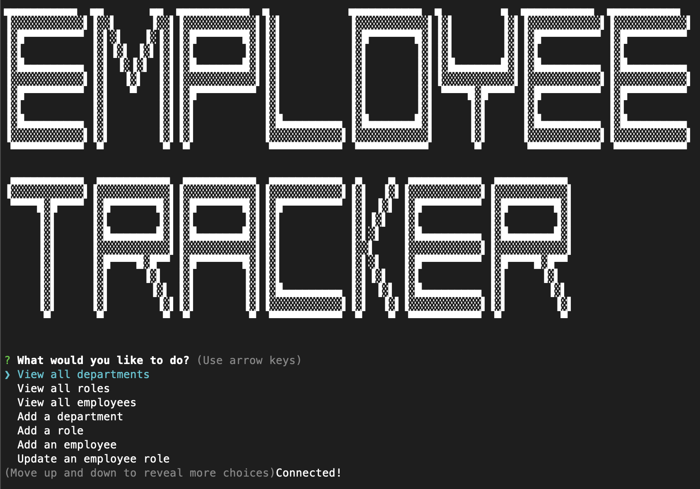

# Employee Tracker

## Description

This is a command-line application that allows the user to view and manage the departments, roles, and employees in their company so that they can organize and plan their business.

## Installation

To install this application, you will need to clone the repository from GitHub. You will also need to install dependencies by running `npm install` in the command line. You will also need to install MySQL.

## Usage

To use this application, you will need to run `node server.js` in the command line. You will then be prompted with a series of questions. You can view the database by selecting `View All Employees`, `View All Employees By Department`, or `View All Employees By Manager`. You can add to the database by selecting `Add Employee`, `Add Role`, or `Add Department`. You can update the database by selecting `Update Employee Role` or `Update Employee Manager`. You can delete from the database by selecting `Delete Employee`, `Delete Role`, or `Delete Department`. You can also exit the application by selecting `Exit`.

## License

This project is licensed under the MIT license.

## Contributing

If you would like to contribute to this project, please contact me at the email address below.

## Questions

If you have any questions about this project, please contact me [by email](mailto:jdhawks.dev@gmail.com). You can find more of my work on [github](https://github.com/jdhawks2132)
